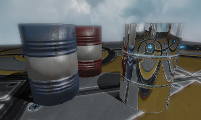
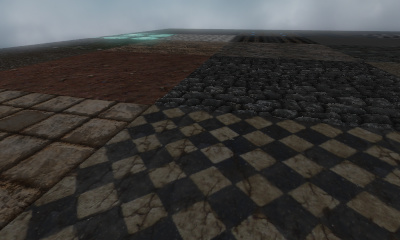
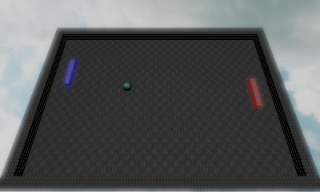
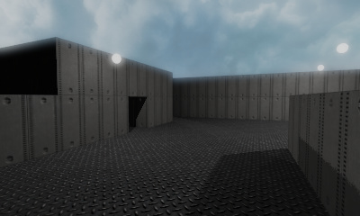
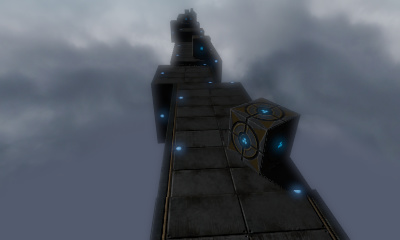

WeepEngine 
==============================================

This is a small personal game engine. It's mainly a platform for me to experiment with OpenGL and perhaps build small game prototypes. While you can use it too under the MIT license, you probably shouldn't as it's incomplete, inefficient and buggy.

  

  

## Features

Many might be unpolished...

* OpenGL 4 forward renderer
	- One directional sun light with shadow mapping
	- Multiple point lights with omnidirectional shadow maps
	- HDR with multiple tonemap functions
	- Bloom / glow
	- Diffuse / normal / specular / emission / height / AO map support
	- Dynamic reflections with reflectivity map support
	- Automatic mesh smoothing with tessellation shaders
	- Postprocessing effects: vignette, sepia, saturation control, chromatic aberration
	- #define based uber shader
	- Automatic shader permutation generation based on material properties
* Mesh loading from Wavefront .obj, Inter-Quake Model .iqm and heightmap images
* Basic skeletal animation (GPU skinning)
* Entity-component based architecture
* Physics through Bullet dynamics library
* Hotloadable gameplay code modules
* JSON based configuration and scene declaration
* ImGui user interface integration
* Sound system
* Runs on Linux and Windows (mostly)

## Design Principles

Use modern OpenGL with no regard to e.g. ES 2.0 compatibility. While no other rendering backends are planned, keep OpenGL code separated in the render device class and pull render API independent stuff to a higher level.

Avoid creating engine specific formats and prefer to load easily editable, widely used files such as obj, png and jpg directly. This also avoids the need for an asset build step. However, don't try to support everything under the sun, but instead focus on few good ones that get the job done.

Try to be cross-platform but actively only on Linux and Windows.

Avoid dependencies and prefer small, embeddable ones. Use no GPL licensed code (expect possibly with separate tools).

Use modern C++11 with STL, but no Boost. Also try to keep the amount of templates and inheritance at a minimum, and prefer simple solution instead of lots of abstraction levels etc.

## Known Issues

Here's some things that need work. The list is by no means exhaustive.

* There is little multi-threading going on
* Sun shadow map really needs cascades
* I'm sceptical whether all tonemap functions work as they should
* Animation and sound systems are very basic
* Gameplay module hotloading fails in some situations
* Entity/component destroying works poorly as it's currently implemented
* Windows support is fragile

## Dependencies

You need C++11 capable compiler and CMake. A number of third-party libraries are included in the repository and built as a part of the build process (see "third-party" subfolder). In addition, you need SDL 2.0.2+ and OpenGL drivers installed.

The core repository only includes some debug assets, so you probably also want to have "weep-media" repository (cloned as a sub folder next to this readme).

## Building

	mkdir build
	cd build
	cmake ..
	make

## Acknowledgements

Renderer code, especially shader code owes a lot to various tutorials, among others:

* http://learnopengl.com/
* http://www.opengl-tutorial.org/
* http://www.sunandblackcat.com/other.php

## License

MIT, see LICENSE file for details.

