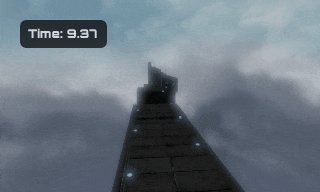
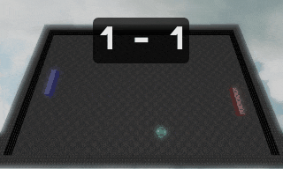
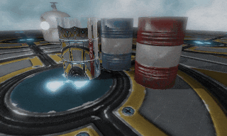
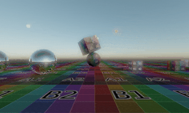

WeepEngine 
==============================================

This is a small personal mostly abandoned game engine. It's mainly a platform for me to experiment with OpenGL and perhaps build small game prototypes. While you can use it too under the MIT license, you probably shouldn't as it's incomplete, inefficient, buggy and largely undocumented.

  

  

<!--

  

  

-->

## Features

Most are quite unpolished...

* OpenGL 4 forward renderer
	- Multiple directional and spot lights with shadow maps
	- Multiple point lights with omnidirectional shadow maps
	- HDR with multiple tonemap functions
	- Bloom / glow
	- Diffuse / normal / specular / emission / height / AO map support
	- Dynamic reflections with reflectivity map support
	- Automatic mesh smoothing with tessellation shaders
	- LODs
	- Postprocessing effects: vignette, sepia, saturation control, chromatic aberration...
	- #define based uber shader
	- Automatic shader permutation generation based on material properties
	- Automatic shader reload on file change
* Compute shader based GPU particle system
* Mesh loading from Wavefront .obj, Inter-Quake Model .iqm and heightmap images
* Basic skeletal animation (GPU skinning)
* Entity-component based architecture
* Physics through Bullet dynamics library
* Modular gameplay code (hotloadable with Clang on Linux, otherwise embedded into the executable)
* JSON based configuration and scene declaration, with prefab/inheritance support
* Dear ImGui user interface integration
* Sound system based on SoLoud: positional audio, sample randomization, contact sounds
* Basic CPU/GPU profiler integration with a web-browser based UI (Remotery)
* Built-in screenshot and gif movie capture
* Runs on Linux and Windows

## Known Issues

Here's some things that need work. The list is by no means exhaustive.

* There is little multi-threading going on
* Sun shadow map really needs cascades
* Light system is poor, should implement Forward+
* Tonemapping needs adaptive exposure
* Animation and sound systems are very basic
* Gameplay module hotloading only really works on Linux with Clang
* Entity/component destroying works poorly as it's currently implemented
* Can't save any changes made with dev tools (missing serialization, need to edit json by hand)

## Dependencies

You need CMake and C++11 capable compiler. Currently Clang works best as GCC breaks live reload of non-trivial code plugins. Visual Studio 2019 works too, but also has issues with plugin hotload stuff.

A number of third-party libraries are included in the repository and built as a part of the build process (see "third-party" subfolder). In addition, you need SDL 2.0.2+ and OpenGL drivers installed. However, for Visual Studio x64 on Windows, SDL2 binaries and headers are provided in the repository.

The core repository only includes some debug assets, so you probably also want to have `weep-media` repository (cloned as a sub folder next to this readme).

## Building

	mkdir build
	cd build
	cmake ..
	cmake --build .

## Running

Run "weep" from the build directory. You can give the scene to load as a command line argument or select it from the dev tools. See the Readme in `weep-media` repository for some example scenes.

## Acknowledgements

Renderer code, especially shader code owes a lot to various tutorials, among others:

* http://learnopengl.com/
* http://www.opengl-tutorial.org/
* http://www.sunandblackcat.com/other.php

## License

MIT, see LICENSE file for details.

